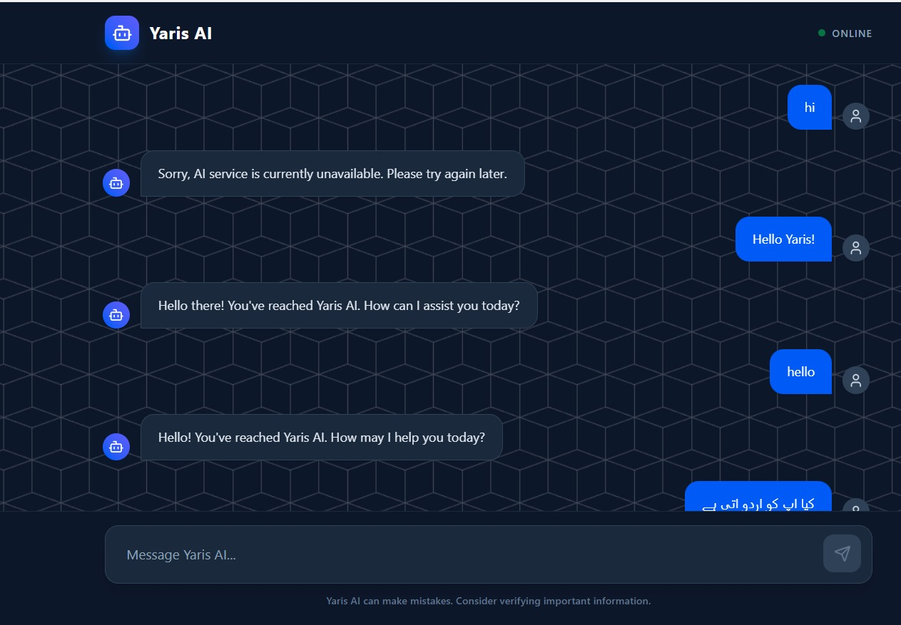

#  Yaris AI 🤖  
### Modern AI Chatbot Web Bot  

<p align="center">
  
  
  
  
</p>

---


## 🌐 Live Demo
       https://your-demo-link.com

---

## ✨ Overview

**Yaris AI** is a modern and responsive AI chatbot application built with a clean architecture and professional UI.  
It allows users to interact with AI in real-time using a smooth chat interface.

---

## 🎯 Features

- 💬 Real-time AI Chat
- ⚡ Fast & Responsive UI
- 🤖 OpenAI Integration
- 🧠 Smart Message Handling
- ⏳ Typing Indicator
- 📱 Mobile Friendly Design
- 🔒 Secure Backend API

---

## 🧱 Project Structure
```
chatbot/
└─ yaris-ai/
   ├─ client/
   │  ├─ public/
   │  │  ├─ favicon.svg
   │  │  └─ icons.svg
   │  ├─ src/
   │  │  ├─ assets/
   │  │  │  ├─ hero.png
   │  │  │  ├─ react.svg
   │  │  │  └─ vite.svg
   │  │  ├─ components/
   │  │  │  ├─ ChatBox.jsx
   │  │  │  ├─ InputBox.jsx
   │  │  │  ├─ Message.jsx
   │  │  │  └─ Navbar.jsx
   │  │  ├─ pages/
   │  │  │  └─ Home.jsx
   │  │  ├─ services/
   │  │  │  └─ api.js
   │  │  ├─ styles/
   │  │  │  └─ main.css
   │  │  ├─ App.jsx
   │  │  ├─ config.js
   │  │  └─ main.jsx
   │  ├─ .gitignore
   │  ├─ eslint.config.js
   │  ├─ index.html
   │  ├─ package-lock.json
   │  ├─ package.json
   │  ├─ README.md
   │  ├─ tailwind.config.js
   │  └─ vite.config.js
   ├─ server/
   │  ├─ config/
   │  │  └─ env.js
   │  ├─ controllers/
   │  │  └─ chatController.js
   │  ├─ routes/
   │  │  └─ chatRoutes.js
   │  ├─ services/
   │  │  └─ openaiService.js
   │  ├─ .env
   │  ├─ app.js
   │  ├─ find_model.js
   │  ├─ package-lock.json
   │  ├─ package.json
   │  ├─ server.js
   │  └─ test_gemini.js
   └─ README.md

```

---

## ⚙️ Tech Stack

### Frontend
- React.js (Vite)
- Tailwind CSS

### Backend
- Node.js
- Express.js

### AI
- OpenAI API

---

## 🛠️ Installation & Setup

### 🔹 Backend Setup

```bash
cd server
npm install

```

Create .env file:
```
PORT=5000
OPENAI_API_KEY=your_api_key_here
```

Run server:
```
npm run dev
```

**🔹 Frontend Setup**
```
cd client
npm install
npm run dev
```

**🔄 How It Works**
```
User Input → React UI → Node.js Server → OpenAI API → Response → UI
```

## 📸 Preview


---


##  Future Improvements
🎨 Advanced UI Design

🧠 Chat History

🌐 Multi-language Support

🔊 Voice Integration


---

## 🤝 Contributing
```
Pull requests are welcome. For major changes, please open an issue first.
```

## 📜 License
This project is licensed under the MIT License.

## 👨‍💻 Author

<div align="center">

**Muhammad Yasir**

💻 [**Portfolio**](https://yasirawaninfo.vercel.app/)  ·  🔗 [**LinkedIn**](https://www.linkedin.com/in/yasirawan4831/)  ·  🐦 [**Twitter (X)**](https://x.com/YasirAwan4831)  ·  🐱 [**GitHub**](https://github.com/YasirAwan4831)

*Designed & developed By [Muhammad Yasir](https://yasirawaninfo.vercel.app/) at  Nexe-Agent*
</div>

<br />
<div align="center">
  
</div>
